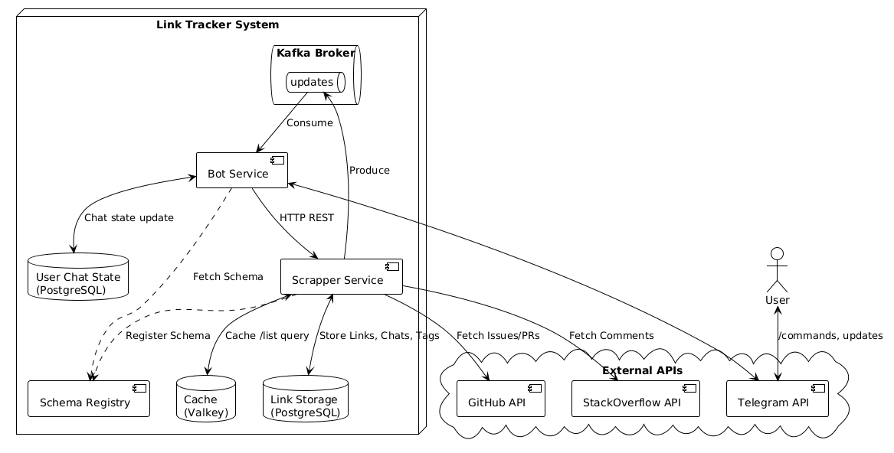
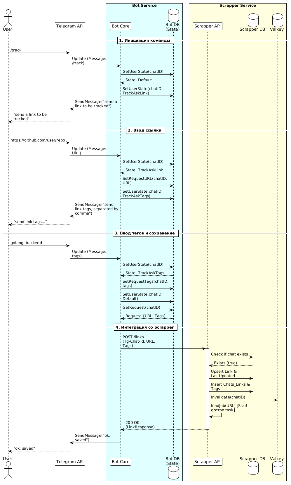

# LinkTracker

**LinkTracker** – Telegram-бот, который отслеживает изменения на веб-страницах сайтов github (репозитории) и stackoverflow (вопросы) и оперативно информирует пользователя о них.

# Команды бота

- `/start` - регистрация
- `/help` — help сообщение
- `/track` — добавить ссылку
- `/untrack` — перестать отслеживать ссылку
- `/list` — вывести список всех отслеживаемых ссылок
- `/list tag1, tag2` — вывести список ссылок, отфильтрованный по тегам
- `/cancel` — отменить текущую операцию

# Конфигурация

Приведён пример `.env` (в репозитории `.env.example`)

`cp .env.example .env`

Для работы достаточно поменять только `APP_TELEGRAM_TOKEN`

```dotenv
DB_SCRAPPER_HOST=postgres
DB_SCRAPPER_PORT=5432
DB_SCRAPPER_USERNAME=user
DB_SCRAPPER_PASSWORD=56692
DB_SCRAPPER_NAME=storage
DB_SCRAPPER_ACCESS_TYPE=SQL # также доступны QUERY_BUILDER и IN_MEMORY

GITHUB_TOKEN="" # пустая строка - без токена
STACKOVERFLOW_TOKEN="" # пустая строка - без токена
SCRAPPER_GITHUB_TIMEOUT=10
SCRAPPER_STACKOVERFLOW_TIMEOUT=10

DB_BOT_HOST=postgres-1
DB_BOT_PORT=5433
DB_BOT_USERNAME=user-1
DB_BOT_PASSWORD=566921
DB_BOT_NAME=storage

APP_TELEGRAM_TOKEN="" # телеграм токен (обязательно)

KAFKA_USER=user1
KAFKA_PASSWORD=29665
KAFKA_TOPIC=updates
KAFKA_CONSUMER_GROUP=updates-consumer
KAFKA_BROKER=kafka:9092

VALKEY_HOST=valkey
VALKEY_PORT=6379
VALKEY_USERNAME=default
VALKEY_PASSWORD=566922

VALKEY_CACHE_TTL=30
VALKEY_TIMEOUT=5

JOB_DURATION=120 # интервал проверок ссылки (в секундах)

BOT_COMMUNICATION_TYPE=KAFKA # способ коммуникации scrapper -> bot (KAFKA или HTTP)

CACHE=TRUE # кеширование /list

SCRAPPER_CLIENT_TIMEOUT=5
SCRAPPER_CLIENT_RETRY_ATTEMPTS=3
SCRAPPER_CLIENT_RETRY_DELAY=500 # это в миллисекундах
SCRAPPER_CLIENT_CB_RATIO_THRESHOLD=0.6
SCRAPPER_CLIENT_CB_MIN_REQUESTS=10
SCRAPPER_CLIENT_CB_OPEN_WINDOW=15
```

# Запуск проекта

`docker compose up`

# Запустить все тесты

`make test`

# Общая архитектура системы


# Диалоговая модель

